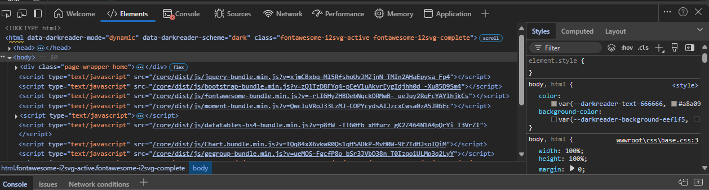
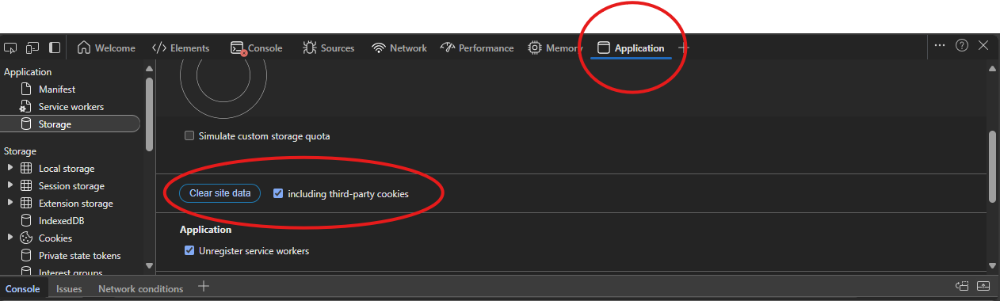

# How to Delete Data for the Current Website in Microsoft Edge

This guide explains how to clear cookies, cache, and site data for the current website in **Microsoft Edge**.

---

## **Step 1: Open the Developer Tools Panel**
1. Make sure you're on the website you want to delete data for.
2. Press **F12** on your keyboard, or **right-click anywhere** on the page and select **Inspect**.
3. This opens the **Developer Tools** panel.

**Screenshot:**  

---

## **Step 2: Go to the Application Tab**
1. At the top of the Developer Tools panel, click on **Application**.
   - If you don’t see it, click on the **» (double arrow)** icon to find it.

---

## **Step 3: Clear the Site Data**
1. On the left side, under **Storage**, click on **Clear site data**.
2. Make sure **Cookies**, **Local Storage**, **Session Storage**, and **Cache Storage** are ticked.
3. Click **Clear site data**.

**Screenshot:**  

---

## **Step 4: Refresh the Page**
1. Close the Developer Tools panel.
2. Press **F5** or click the **Reload button** (🔄) next to the address bar.

---

## **You're Done! 🎉**
The website will now reload with a fresh set of data.

---
